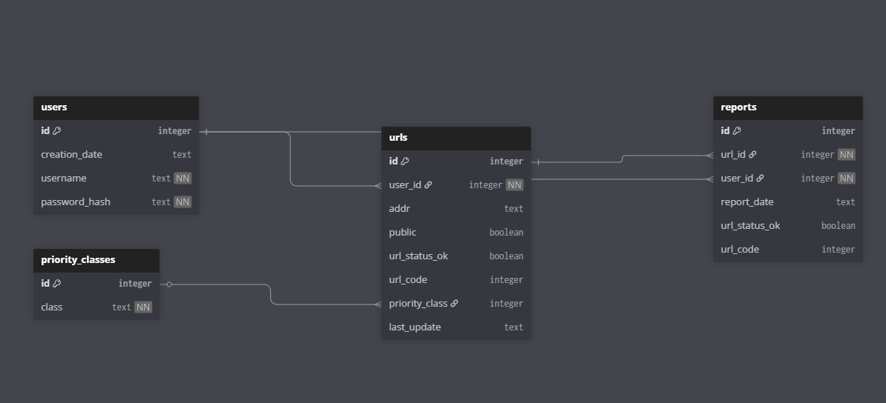

# Simple Website Monitoring Tool

This app is a project created for the University of Helsinki's TKT20019 - Databases and Web Programming course (Spring/2026). It uses Python, the Flask framework, and an SQLite database to provide basic functionality for monitoring website status. Please note that the features are limited to these technologies, focusing on simple interactions like login, register, http requests.

## Application features

-   Users can create an account and log in to the app.
-   Users can add, copy, edit and delete websites entries they want to monitor.
-   Users can toggle website visibility to be public/hide.
-   Users can search for website entries using keywords.
-   Users can assign a monitored website a priority listing order.
-   The user's page displays statistics and reports that user's websites have received.
-   Users can generate status reports for their own websites and other users public websites.


## Installation

Requirements:
- Python 3.14
- Pip 25.3

Create and activate a virtual environment

```
Create:
$ python3 -m venv venv

Activate (Linux):
$ source venv/bin/activate

Activate (Windows):
$ venv\Scripts\activate
```

Install Flask

```
$ pip install flask
```

Option1 (Recommended): Create a database, populate the database and generate .env variables

```
$ python install.py
```

Start the Flask app

```
$ flask run
```

Option2 (Manual): Create a database, populate the database & generate_secret key
```
$ sqlite3 database.db < schema.sql
$ sqlite3 database.db < init.sql
$ generate secret key at: https://www.seckeygen.com/
$ create .env file and add the generated secret key to variable: SECRET_KEY = 'YOUR_SECRET_KEY'
```

Start the Flask app

```
$ flask run
```

## Course Progress

See [course progress documentation](docs/course-progress-finnish.md) (in finnish) for more details.

- [x] 18.1.2026 Interim Submission 1
[branch interim-1](https://github.com/koenol/simple-website-monitoring-tool/tree/interim-1)
- [x] 1.2.2026 Interim Submission 2
[branch interim-2](https://github.com/koenol/simple-website-monitoring-tool/tree/interim-2)
- [x] 8.2.2026 Peer Review 1 
[peer review](https://github.com/HarriApp/soutuporssi/issues/1)
- [x] 15.2.2026 Interim Submission 3
[branch interim-3](https://github.com/koenol/simple-website-monitoring-tool/tree/interim-3)
- [x] 22.2.2026 Peer Review 2
[peer review](https://github.com/henkkasplund/RENTER/issues/2)
- [x] 1.3.2026 Final Submission
[main branch](https://github.com/koenol/simple-website-monitoring-tool)

## Database Diagram

_Last Updated: 01.03.2026_ (dd/mm/yyyy)

